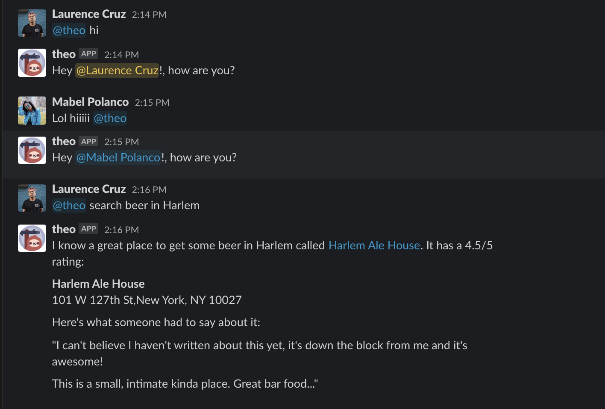

<p align="center">


[](https://travis-ci.com/lpcruz/theo)
# theo
Your friendly neighborhood sidekick sloth.



# How it works
Theo listens for patterns when mentioned in [Slack](https://www.slack.com) and responds back with information such as weather, businesses, recipes, workouts, news and more!

# Message formatting
Theo's responses are made with [Slack's Block Kit Builder](https://api.slack.com/tools/block-kit-builder) and sent via an [incoming webhook.](https://api.slack.com/messaging/webhooks)
```javascript
[
  {
    type: 'section',
    text: {
      type: 'mrkdwn',
      text: `Hello, world!`
     }
  }
];
```

# Usage
```
$ npm run theo
```

Use [ngrok](https://ngrok.com/) to forward your local server to an available port.

```
$ ./ngrok http 4390
```

This is just a test change
